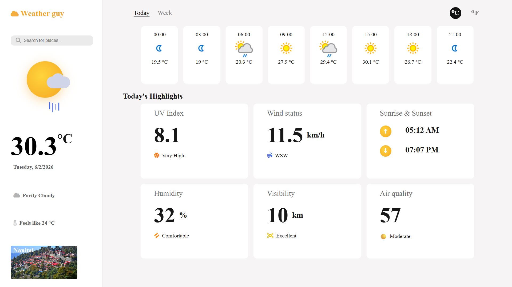

<h1>☁️ Weather Guy</h1>

<strong>Weather Guy</strong> is a modern weather dashboard built using
<strong>HTML</strong>, <strong>CSS</strong>, and <strong>JavaScript</strong>.
The application provides real-time weather information, hourly forecasts,
air quality data, and dynamic city images using external APIs.

<h2>📸 Preview</h2>

<h2>🚀 Features</h2>

<ul>
    <li>Search weather by city name</li>
    <li>Real-time weather conditions</li>
    <li>Hourly weather forecast</li>
    <li>Weekly weather forecast</li>
    <li>Temperature unit conversion (°C / °F)</li>
    <li>UV Index information</li>
    <li>Wind speed</li>
    <li>Sunrise and sunset timings</li>
    <li>Humidity tracking</li>
    <li>Visibility information</li>
    <li>Air Quality Index (AQI)</li>
    <li>Dynamic city images</li>
</ul>

<h2>🛠 Technologies Used</h2>

<ul>
    <li>HTML5</li>
    <li>CSS3</li>
    <li>Vanilla JavaScript</li>
    <li>WeatherAPI</li>
    <li>Unsplash API</li>
</ul>

<h2>🔌 APIs Used</h2>

<h3>🌦 WeatherAPI</h3>
<ul>
    <li>Current weather conditions</li>
    <li>Hourly forecasts</li>
    <li>Weekly forecasts</li>
    <li>Air quality data</li>
    <li>Astronomical information (sunrise & sunset)</li>
</ul>

<h3>🖼 Unsplash API</h3>
<ul>
    <li>Dynamic city background images</li>
    <li>Location-based visual enhancement</li>
</ul>

<h2>📊 Weather Highlights</h2>

<ul>
    <li>UV Index Monitoring</li>
    <li>Wind Status</li>
    <li>Humidity Levels</li>
    <li>Visibility Tracking</li>
    <li>Air Quality Index</li>
    <li>Sunrise & Sunset Information</li>
</ul>

<h2>🧠 What I Learned</h2>

<ul>
    <li>Working with REST APIs</li>
    <li>Fetching and processing JSON data</li>
    <li>Asynchronous JavaScript (async/await)</li>
    <li>Dynamic DOM manipulation</li>
    <li>Weather data visualization</li>
    <li>API error handling</li>
    <li>Building responsive dashboards</li>
</ul>

<h2>🔮 Future Improvements</h2>

<ul>
    <li>Geolocation support</li>
    <li>Weather alerts and notifications</li>
    <li>Dark / Light theme toggle</li>
    <li>Favorite cities feature</li>
    <li>Weather map integration</li>
</ul>

<h2>⚠️ Disclaimer</h2>

Weather information is provided by WeatherAPI.
Images are sourced dynamically through Unsplash.
This project is intended for educational and portfolio purposes.

<h2>👤 Author</h2>

<strong>Areeb Baig</strong> 

GitHub:
<a href="https://github.com/areebbaig580">
https://github.com/areebbaig580
</a>

